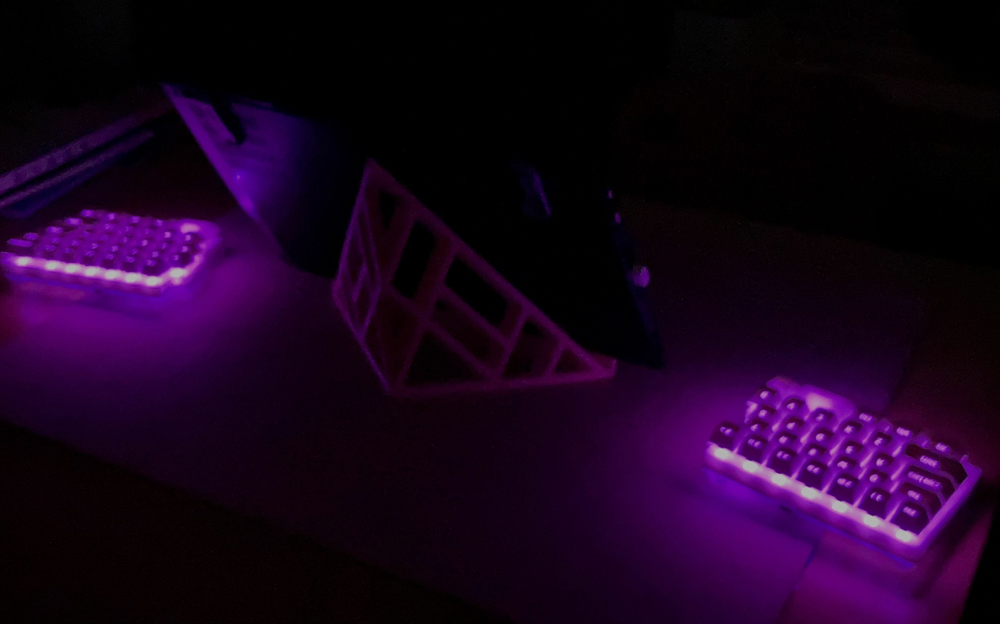

# gallery
Gallery of AniseHID devices

NOTICE: due to the RGB LED power consumption(~100mA each side), and the current status that rgb has no actual function(zmk has not yet utilize the rgb as indicator or something else related to keyboard state), the RGB LED is on only for nice photo shot, you may not expect RGB LED can always on.

---------

# Layout avaiable
here are some layout already built, generated by anise-kbd's desc-gen

## ANISE60B

this is the basic layout which was built first, the bottom row is squeezed for the reason I want to use 2u space, and make my thumb to type key next to space easier.

## ANISE60B 6R
   

this is useing the same pcb as anise60b, just cut the PCB in a different way, every PCB designed support this feature. For now, only top rows are split in this way, key B which is sometimes typed by right hand by some user, are not capable to do so due to the lack of time, if you got the need and time, you may do it yourself.

## ANISE60BNAV 

Just a slightly modification to basic, add a nav cluster to bottom right.

## ANISE60HH

For happy hacking.

## ANISE60EU

ISO keyboard for European users, shows the capability of generator to handle ISO return key.

## ANISE60MN

Shift row left shift by 0.25u.

## ANISE60MJ

For japanese users who want a Kana key.

## ANISE85A

The larger one with FN row and a nav cluster with somewhat normal position.

